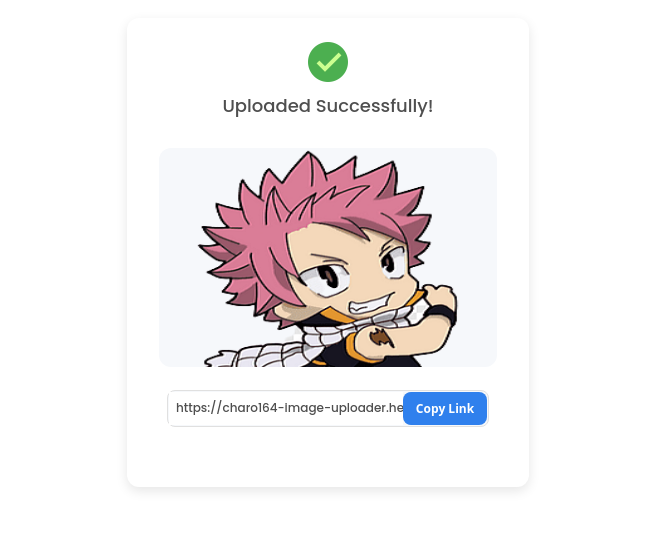

<h1 align="center">Image Uploader</h1>

<div align="center">
   Solution for a challenge from  <a href="http://devchallenges.io" target="_blank">Devchallenges.io</a>.
</div>

<div align="center">
  <h3>
    <a href="https://charo164-image-uploader.herokuapp.com">
      Demo
    </a>
    <span> | </span>
    <a href="https://github.com/charo164/image-uploader">
      Solution
    </a>
    <span> | </span>
    <a href="https://devchallenges.io/challenges/O2iGT9yBd6xZBrOcVirx">
      Challenge
    </a>
  </h3>
</div>


## Table of Contents
- [Overview](#overview)
- [Built With](#built-with)
- [Features](#features)
- [How to use](#how-to-use)

## Overview


### Built With

- [React](https://reactjs.org/)
- [Express](https://expressjs.com/)
- [Ejs](https://ejs.co/)

## Features

This application/site was created as a submission to a [DevChallenges](https://devchallenges.io/challenges) challenge. The [challenge](https://devchallenges.io/challenges/Bu3G2irnaXmfwQ8sZkw8) was to build an application to complete the given user stories.

## How To Use


To clone and run this application, you'll need [Git](https://git-scm.com) and [Node.js](https://nodejs.org/en/download/) (which comes with [npm](http://npmjs.com)) installed on your computer. From your command line:

```bash
# Clone this repository
$ https://github.com/charo164/image-uploader

# Install dependencies
$ npm install

# Run the app
$ npm start
```

